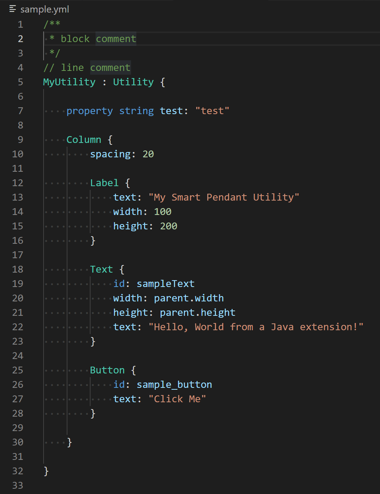

# YASKAWA Markup Language (YML) Support README

This is the README for vs code extension "YASKAWA Markup Language (YML) Support". 

## Features

This extension support syntax highlight for YASKAWA Markup Language (YML) as following image.

## Third-Party Software
This software includes materials developed by third parties.
Please see the [thirdparty](thirdparty/README.md) folder about third-party software.

## Known Issues

## Release Notes
## [0.3.0]
- Added syntax highlight of alias property.
- Added Go To Definition for item id.
- Added Go To Definition for item property.
- Added Go To Definition for translation properties.
- Added Hover for translation properties.

### [0.2.0]
- Added Go To Definition for YML Item.

### [0.1.0]
- Added YML snippets.

### [0.0.1]
- Initial release of this extension.

